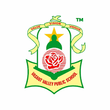

---
# Feel free to add content and custom Front Matter to this file.

layout: default
---

{:class="mb-12 text-3xl font-bold prose"}
We provide FREE Tech Education to students studying from class 6th onwards training them on various software development technologies, frameworks, tools, etc to become the early adopters.

{:class="mb-4 font-bold"}
The majority of the topics we cover are:-

{:class="mb-4 list-disc list-inside"}
- Web Application Development
- Mobile Application Development
- Desktop Application Development
- Database Management
- REST APIs
- Blockchain
- and many others

{:class="mb-4 font-bold"}
We cover 3 main full-stack frameworks:-

{:class="mb-12 list-disc list-inside"}
- Ruby on Rails
- VueJS
- Ethereum

<%= render "current_sponsors", metadata: site.metadata %>

{:class="mb-4 font-bold text-2xl"}
## Educating students of:-

    
    
    
    
    
    
    
and many more ...

